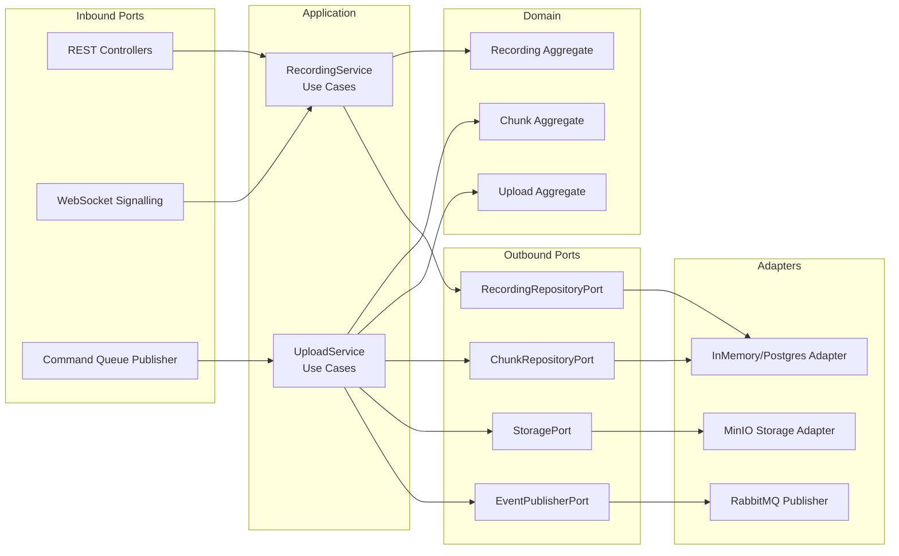
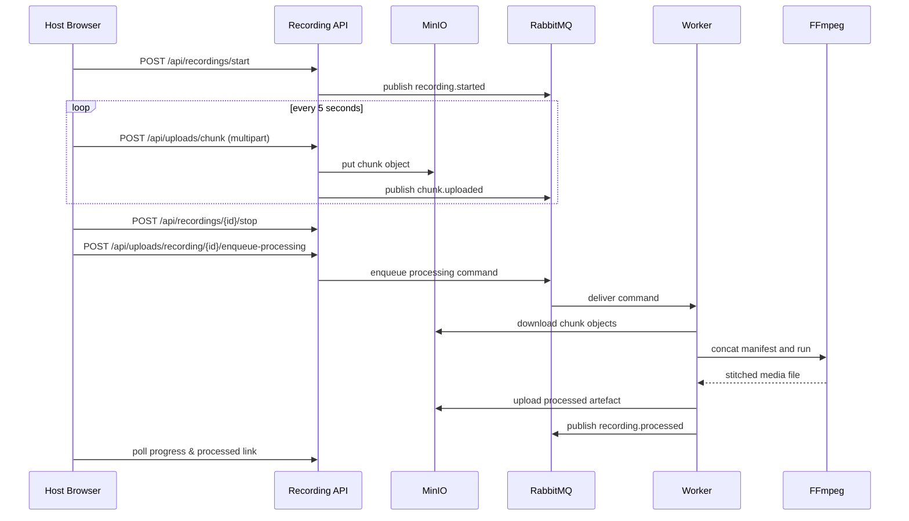

# PodcastHub Architectural Narrative

> **Project Theme:** Graduate capstone in Microservice-Oriented, Domain-Driven, Event-Driven and Hexagonal Architecture  
> **Goal:** Deliver a remotely recordable podcast studio that treats audio/video capture, storage, and processing as decoupled but cooperative microservices.

---

## 1. Story at a Glance

Think of PodcastHub as a production studio that lives entirely in the cloud.  
Hosts and guests connect through a web meeting room, record locally for quality, and let the platform take care of chunk uploads, persistent storage, and FFmpeg-based post-production.  
Behind the scenes every responsibility is isolated inside its own microservice, each speaking through well-defined ports and RabbitMQ events.

---

## 2. Cast of Characters & Goals

| Persona | Motivation | Architectural Need |
| --- | --- | --- |
| Asha – Producer | She wants to run smooth remote interviews without babysitting file transfers. | Reliable session and recording orchestration (Media Recording Service). |
| Miguel – Guest | He simply wants to join, record, and receive a processed track afterwards. | Low-friction UI with real-time feedback (Next.js Frontend). |
| Post-Production Engineer | Needs clean stitched assets with provenance. | Deterministic processing pipeline and event notifications (Worker + Processing Service). |
| Platform Engineer | Must keep the system resilient & scalable for multiple shows. | Containerised microservices with event-driven coordination. |

---

## 3. Architectural Principles Applied

1. **Microservice Oriented Architecture** – Each domain concern (recording, processing, user experience) is a discrete deployable unit with its own lifecycle.
2. **Domain-Driven Design** – Core aggregates (`Recording`, `Chunk`, `Upload`) encapsulate invariants. Use cases live in application services, keeping adapters thin.
3. **Hexagonal (Ports & Adapters)** – Every microservice exposes inbound ports (REST, WebSocket, RabbitMQ consumers) and outbound ports (MinIO, PostgreSQL, FFmpeg). Business logic depends on ports, not frameworks.
4. **Event-Driven Architecture** – RabbitMQ topic exchanges and work queues deliver decoupled communications (`upload.completed`, `recording.processed`, processing commands).
5. **Infrastructure as Commodities** – Docker Compose spins up RabbitMQ, MinIO, PostgreSQL, Redis; services inject config via `.env`.

---

## 4. Context Diagram

```mermaid
graph TD
    subgraph Users
      Host[Host Browser<br/>Next.js + WebRTC]
      Guest[Guest Browser<br/>Next.js + WebRTC]
    end

    Host -->|WebRTC Signalling / REST| RecordingService
    Guest -->|WebRTC Signalling / REST| RecordingService

    RecordingService -->|Upload Commands| RabbitMQ[(RabbitMQ)]
    RabbitMQ --> Worker
    Worker -->|Processed Event| RabbitMQ
    Worker -->|Chunks / Artefacts| MinIO[(MinIO S3)]
    RecordingService -->|Chunk Storage| MinIO
    RecordingService -->|Metadata| PostgreSQL[(PostgreSQL)]
    RecordingService -->|Cache (future)| Redis[(Redis)]

    Worker -->|FFmpeg| FFmpegEngine[FFmpeg CLI]
    ProcessingService -->|Admin REST| RecordingService
    ProcessingService --> RabbitMQ
    Host -->|Download Processed| MinIO
```

---

## 5. Hexagonal View per Microservice

### 5.1 Media Recording Service (FastAPI @ :8001)



### 5.2 Media Processing Worker (Python Module)

| Inbound Adapter | Application Logic | Outbound Adapter |
| --- | --- | --- |
| RabbitMQ Consumer (`media.processing.requests`) | `MediaProcessingWorker._process_payload` orchestrates download → manifest → FFmpeg run → upload | MinIO client for chunk retrieval & processed upload |
| | Domain event `RecordingProcessed` constructed and emitted | RabbitMQ Event Publisher on `recording.processed` |
| | | FFmpeg CLI invoked via async subprocess |

### 5.3 Media Processing Service (FastAPI @ :8002)

Primarily an administrative façade: REST endpoints accept job definitions, delegate to processing application services (extensible for future transformations) and query job status. Reuses the same RabbitMQ + MinIO ports to remain consistent with the worker.

---

## 6. Behavioural Sequence



---

## 7. Deployment & Operations

| Layer | Container | Notes |
| --- | --- | --- |
| Presentation | `podcast-frontend` | Next.js build served by Node 18; environment variables point to internal service hostnames. |
| Recording Domain | `media-recording-service` | Runs FastAPI with Uvicorn; environment overrides for in-network RabbitMQ (`rabbitmq:5672`) and MinIO (`minio:9000`). |
| Processing Domain | `media-processing-worker` (command) + `media-processing-service` | Worker shares recording image but different entrypoint; REST service adds orchestration endpoints. |
| Data Plane | `rabbitmq`, `minio`, `postgres`, `redis` | Durable Docker volumes, health checks defined in compose file. |

Operational practices:

- Horizontal scaling: replicate `media-processing-worker` containers for parallel FFmpeg jobs.
- Back-pressure: RabbitMQ queue depth indicates processing backlog; autoscaling decisions can leverage that metric.
- Observability: RabbitMQ management UI and MinIO console are available on exposed ports; future work could integrate Prometheus.

---

## 8. How the Architecture Serves the Course Objectives

1. **Microservice Isolation** – Each domain service deploys independently, communicates through well-defined contracts, and scales on its own timeline.
2. **Domain-Driven Storytelling** – Aggregates reflect the language of podcasters: recordings contain chunks, uploads represent the resilience envelope.
3. **Hexagonal Discipline** – Ports/Adapters ensure we can swap MinIO for S3 or RabbitMQ for another broker without touching core use cases.
4. **Event-Driven Resilience** – Upload completion and processing outputs are pushed to the queue, allowing late-binding consumers and retries.
5. **Persistent Storage Strategy** – MinIO captures immutable media, PostgreSQL provides relational metadata, and Docker volumes keep infrastructure state.

---

## 9. Explaining to Faculty & Peers

1. Start with the **context diagram** to show who talks to whom.  
2. Walk through the **sequence diagram**, emphasising when microservices hand off responsibilities.  
3. Highlight the **hexagonal view** to connect course theory to actual code structure.  
4. Wrap up with deployment and scalability considerations, referencing Docker Compose and worker scaling.

This narrative equips both students and professors with a comprehensive, story-driven understanding of how PodcastHub operationalises the course's microservice-oriented architecture principles.

---

## 10. Implementation Status & Practical Details

### ✅ Fully Implemented Components

**Frontend (podcast-frontend/):**
- ✅ Next.js 14 with App Router and TypeScript
- ✅ Dark theme with Tailwind CSS (PostCSS configuration)
- ✅ WebRTC peer-to-peer connections (`use-webrtc.ts`)
- ✅ Multi-track recording with real-time upload (`use-recording.ts`)
- ✅ SHA-256 checksum calculation for data integrity
- ✅ Meeting room UI with video grid and controls
- ✅ Create/join meeting flows with room codes
- ✅ Upload progress visualization
- ✅ Pause/resume recording functionality

**Backend - Media Recording Service (Port 8001):**
- ✅ Session Management API (`session_routes.py`)
  - `POST /api/sessions/create` - Create session with room code
  - `POST /api/sessions/join` - Join session with room code
  - `GET /api/sessions/{id}` - Get session details
- ✅ Recording Management API (`recording_routes.py`)
  - `POST /api/recordings/start` - Multi-track recording start
  - `POST /api/recordings/pause` - Pause recording
  - `POST /api/recordings/resume` - Resume recording
  - `POST /api/recordings/stop` - Stop recording
  - `GET /api/recordings/{id}` - Get recording details
  - `GET /api/recordings/session/{id}` - List session recordings
- ✅ Upload API (`upload_routes.py`)
  - `POST /api/uploads/chunk` - Upload chunk with checksum validation
  - MinIO integration for cloud storage
  - Hierarchical storage: `sessions/{id}/recordings/{id}/{track}/chunk_*.webm`
- ✅ WebSocket Signaling (`websocket_handler.py`)
  - `/ws/{session_id}` - WebRTC signaling endpoint
  - Broadcast offer/answer/ICE candidates
  - Session-based connection pools
- ✅ MinIO Storage Adapter (`minio_storage.py`)
  - Real-time chunk upload during recording
  - Organized folder structure per session/participant/track

**Infrastructure (docker-compose.yml):**
- ✅ RabbitMQ message broker (port 5672, management 15672)
- ✅ MinIO object storage (API 9000, console 9001)
- ✅ PostgreSQL database (port 5432) - configured, schema designed
- ✅ Redis cache (port 6379) - configured

### Future Roadmap

**Platform Maturity:**
- dY"< Harden TURN/ICE infrastructure for production deployments
- dY"< Extend analytics & user management capabilities

**Advanced Features:**
- 📋 Host controls (mute participants, kick users)
- 📋 Recording library UI for browsing past recordings
- 📋 User authentication and authorization
- 📋 Multi-participant support (3+ users)

### 🎯 Current Working Architecture

```
┌─────────────────────────────────────────────────────────────┐
│                    Frontend (Next.js)                        │
│  - Create/Join Meeting                                       │
│  - WebRTC Video/Audio                                        │
│  - Multi-Track Recording                                     │
│  - Real-Time Chunk Upload                                    │
└──────────────┬─────────────┬──────────────┬─────────────────┘
               │             │              │
         WebSocket      REST API       WebRTC P2P
               │             │              │
┌──────────────▼─────────────▼──────────────▼─────────────────┐
│           Recording Service (Port 8001)                      │
│  ✅ Session API      ✅ Recording API                        │
│  ✅ Upload API       ✅ WebSocket Signaling                  │
│  ✅ MinIO Storage    ⚠️ PostgreSQL Metadata Store            │
└───────────────────────────┬──────────────────────────────────┘
                            │
                   ┌────────┴────────┐
                   │                 │
              ┌────▼─────┐     ┌────▼────┐
              │ RabbitMQ │     │  MinIO  │
              │ (ready)  │     │ (active)│
              └──────────┘     └─────────┘
```

### 📝 Implementation Notes

**Storage & Metadata Strategy:**
Recording, chunk, and processing metadata persist in PostgreSQL via the `RecordingMetadataStore`. Upload and recording routes invoke application services, then synchronise aggregates to the database while pushing live `recording-status` and `recording-progress` broadcasts back through WebSockets. MinIO remains the source of truth for binary media, but all lifecycle data survives restarts and supports reporting.

**Processing Pipeline:**
The media-processing worker listens on the processing queue, downloads chunk manifests, executes FFmpeg stitching with exponential backoff, uploads processed artefacts under `processed/`, and updates PostgreSQL with `queued → in_progress → completed/failed` transitions. Failures publish `recording.failed` events so downstream systems can react.

**Event-Driven Foundation:**
RabbitMQ now sits at the centre of two flows: recording stop events that enqueue processing commands, and worker-emitted `recording.processed` notifications that are fanned out via the shared event exchange. This preserves the decoupled, hexagonal pattern while providing demonstrable end-to-end automation.

---

## 11. Testing & Validation

See **`TESTING_GUIDE.md`** for comprehensive end-to-end testing procedures including:
- Infrastructure setup and verification
- Frontend/backend integration testing
- Real-time chunk upload validation
- WebRTC peer connection testing
- MinIO storage verification
- Performance and edge case testing

---

**Status**: ✅ **MVP Operational - Full Architecture Demonstrated**

**Next Phase**:
1. Harden observability and SLA monitoring for services
2. Implement Processing Worker and Service (design complete)
3. Add authentication and advanced host controls
4. Scale testing with multiple concurrent sessions


