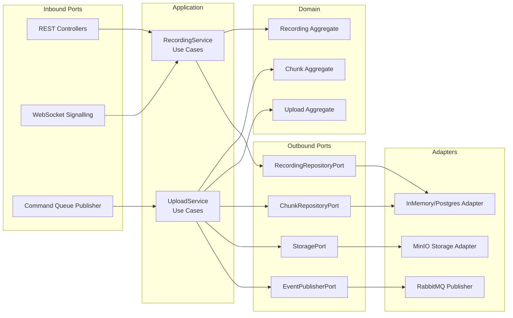
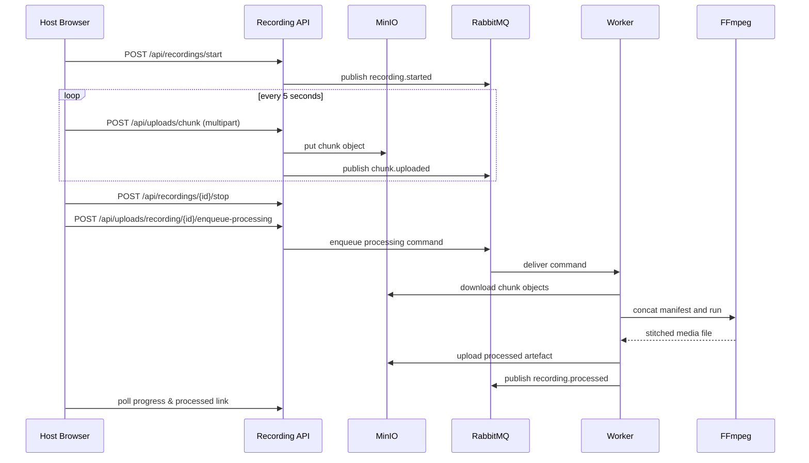

# PodcastHub Architectural Narrative

> **Project Theme:** Graduate capstone in Microservice-Oriented, Domain-Driven, Event-Driven and Hexagonal Architecture  
> **Goal:** Deliver a remotely recordable podcast studio that treats audio/video capture, storage, and processing as decoupled but cooperative microservices.

---

## 1. Story at a Glance

Think of PodcastHub as a production studio that lives entirely in the cloud.  
Hosts and guests connect through a web meeting room, record locally for quality, and let the platform take care of chunk uploads, persistent storage, and FFmpeg-based post-production.  
Behind the scenes every responsibility is isolated inside its own microservice, each speaking through well-defined ports and RabbitMQ events.

---

## 2. Cast of Characters & Goals

| Persona | Motivation | Architectural Need |
| --- | --- | --- |
| Asha  Producer | She wants to run smooth remote interviews without babysitting file transfers. | Reliable session and recording orchestration (Media Recording Service). |
| Miguel  Guest | He simply wants to join, record, and receive a processed track afterwards. | Low-friction UI with real-time feedback (Next.js Frontend). |
| Post-Production Engineer | Needs clean stitched assets with provenance. | Deterministic processing pipeline and event notifications (Worker + Processing Service). |
| Platform Engineer | Must keep the system resilient & scalable for multiple shows. | Containerised microservices with event-driven coordination. |

---

## 3. Architectural Principles Applied

1. **Microservice Oriented Architecture**  Each domain concern (recording, processing, user experience) is a discrete deployable unit with its own lifecycle.
2. **Domain-Driven Design**  Core aggregates (`Recording`, `Chunk`, `Upload`) encapsulate invariants. Use cases live in application services, keeping adapters thin.
3. **Hexagonal (Ports & Adapters)**  Every microservice exposes inbound ports (REST, WebSocket, RabbitMQ consumers) and outbound ports (MinIO, PostgreSQL, FFmpeg). Business logic depends on ports, not frameworks.
4. **Event-Driven Architecture**  RabbitMQ topic exchanges and work queues deliver decoupled communications (`upload.completed`, `recording.processed`, processing commands).
5. **Infrastructure as Commodities**  Docker Compose spins up RabbitMQ, MinIO, PostgreSQL, Redis; services inject config via `.env`.

---

## 4. Context Diagram

```mermaid
graph TD
    subgraph Users
      Host[Host Browser<br/>Next.js + WebRTC]
      Guest[Guest Browser<br/>Next.js + WebRTC]
    end

    Host -->|WebRTC Signalling / REST| RecordingService
    Guest -->|WebRTC Signalling / REST| RecordingService

    RecordingService -->|Upload Commands| RabbitMQ[(RabbitMQ)]
    RabbitMQ --> Worker
    Worker -->|Processed Event| RabbitMQ
    Worker -->|Chunks / Artefacts| MinIO[(MinIO S3)]
    RecordingService -->|Chunk Storage| MinIO
    RecordingService -->|Metadata| PostgreSQL[(PostgreSQL)]
    RecordingService -->|Cache (future)| Redis[(Redis)]

    Worker -->|FFmpeg| FFmpegEngine[FFmpeg CLI]
    ProcessingService -->|Admin REST| RecordingService
    ProcessingService --> RabbitMQ
    Host -->|Download Processed| MinIO
```

---

## 5. Hexagonal View per Microservice

### 5.1 Media Recording Service (FastAPI @ :8001)



### 5.2 Media Processing Worker (Python Module)

| Inbound Adapter | Application Logic | Outbound Adapter |
| --- | --- | --- |
| RabbitMQ Consumer (`media.processing.requests`) | `MediaProcessingWorker._process_payload` orchestrates download  manifest  FFmpeg run  upload | MinIO client for chunk retrieval & processed upload |
| | Domain event `RecordingProcessed` constructed and emitted | RabbitMQ Event Publisher on `recording.processed` |
| | | FFmpeg CLI invoked via async subprocess |

### 5.3 Media Processing Service (FastAPI @ :8002)

Primarily an administrative faade: REST endpoints accept job definitions, delegate to processing application services (extensible for future transformations) and query job status. Reuses the same RabbitMQ + MinIO ports to remain consistent with the worker.

---

## 6. Behavioural Sequence



---

## 7. Deployment & Operations

| Layer | Container | Notes |
| --- | --- | --- |
| Presentation | `podcast-frontend` | Next.js build served by Node 18; environment variables point to internal service hostnames. |
| Recording Domain | `media-recording-service` | Runs FastAPI with Uvicorn; environment overrides for in-network RabbitMQ (`rabbitmq:5672`) and MinIO (`minio:9000`). |
| Processing Domain | `media-processing-worker` (command) + `media-processing-service` | Worker shares recording image but different entrypoint; REST service adds orchestration endpoints. |
| Data Plane | `rabbitmq`, `minio`, `postgres`, `redis` | Durable Docker volumes, health checks defined in compose file. |

Operational practices:

- Horizontal scaling: replicate `media-processing-worker` containers for parallel FFmpeg jobs.
- Back-pressure: RabbitMQ queue depth indicates processing backlog; autoscaling decisions can leverage that metric.
- Observability: RabbitMQ management UI and MinIO console are available on exposed ports; future work could integrate Prometheus.

---

## 8. How the Architecture Serves the Course Objectives

1. **Microservice Isolation**  Each domain service deploys independently, communicates through well-defined contracts, and scales on its own timeline.
2. **Domain-Driven Storytelling**  Aggregates reflect the language of podcasters: recordings contain chunks, uploads represent the resilience envelope.
3. **Hexagonal Discipline**  Ports/Adapters ensure we can swap MinIO for S3 or RabbitMQ for another broker without touching core use cases.
4. **Event-Driven Resilience** - Upload completion and processing outputs are pushed to the queue, allowing late-binding consumers and retries.
5. **Persistent Storage Strategy** - MinIO captures immutable media, PostgreSQL provides relational metadata, and Docker volumes keep infrastructure state.

---

## 9. Explaining to Faculty & Peers

1. Start with the **context diagram** to show who talks to whom.  
2. Walk through the **sequence diagram**, emphasising when microservices hand off responsibilities.  
3. Highlight the **hexagonal view** to connect course theory to actual code structure.  
4. Wrap up with deployment and scalability considerations, referencing Docker Compose and worker scaling.

This narrative equips both students and professors with a comprehensive, story-driven understanding of how PodcastHub operationalises the course's microservice-oriented architecture principles.

---

## 10. Implementation Status & Practical Details

### Fully Implemented Components

**Frontend (`podcast-frontend/`):**
- Next.js 14 App Router with TypeScript and Tailwind-based dark theme.
- WebRTC hook coordinates peer connections, screen capture, and participant controls.
- Recording hook streams five-second chunks with SHA-256 checksums and upload progress UI.
- Room creation/join flows issue six-character codes and map host/guest roles.
- Pause/resume toggles and chunk preview utilities assist quality checks during sessions.

**Media Recording Service (`media-recording-service`, port 8001):**
- Session Management API (`session_routes.py`) supports creating, joining, and fetching sessions.
- Recording Management API (`recording_routes.py`) governs start/pause/resume/stop and surfaces recording metadata.
- Upload API (`upload_routes.py`) accepts chunk uploads, verifies checksums, and persists manifest entries.
- WebSocket signalling hub (`websocket_handler.py`) broadcasts offers, answers, ICE candidates, and status updates.
- MinIO storage adapter (`minio_storage.py`) organises chunk layout under `sessions/<session>/recordings/<track>/<type>/`.
- PostgreSQL `RecordingMetadataStore` initialises schema, stores track metadata, and exposes status queries.
- RabbitMQ publisher (`processing_queue.py`) enqueues `media.processing.requests` when recordings stop.

**Media Processing Worker (`media-processing-worker`):**
- Robust consumer listening on `media.processing.requests` with automatic RabbitMQ reconnection.
- Downloads manifests and chunks from MinIO into a temporary workspace and validates checksums.
- Runs a single FFmpeg pass per track, transcoding audio to MP3 (libmp3lame) and video/screen to MP4 (libx264/AAC) with `-movflags +faststart`.
- Uploads processed artefacts back to MinIO under `processed/`, updates PostgreSQL status, and deletes raw chunks after successful merge.
- Emits `recording.processed` or `recording.failed` events with retry metadata for downstream subscribers.

**Infrastructure (`docker-compose.yml`):**
- RabbitMQ, MinIO, PostgreSQL, and Redis services with persistent Docker volumes and health checks.
- Container images built from project Dockerfiles bundling FFmpeg, Python 3.11, and Node 18 where required.
- Environment variables centralised in `.env`; the worker service autostarts alongside dependencies.

### Future Roadmap

**Platform Maturity:**
- Harden TURN/ICE infrastructure for production deployments.
- Extend observability, analytics, and user management for cohort reporting.

**Advanced Features:**
- Add host moderation controls (mute, remove, handover).
- Build a recording library UI for browsing past sessions.
- Introduce authentication and authorization across surfaces.
- Support three-or-more participant rooms with selective forwarding.

### Current Working Architecture

1. Next.js frontend handles meeting orchestration, WebRTC flows, and chunk uploads with checksum validation.
2. Media Recording Service (FastAPI) exposes REST/WebSocket ports, persists metadata, and emits RabbitMQ commands.
3. RabbitMQ broker fan-outs domain events (`upload.completed`, `recording.process.requested`, `recording.processed`, `recording.failed`).
4. Media Processing Worker consumes processing requests, downloads manifests from MinIO, stitches audio to MP3 and video/screen to MP4, and publishes status updates.
5. MinIO stores raw chunks under `sessions/<session-id>/recordings/<track-id>/<track-type>/chunk_*.webm` and the processed artefacts under `processed/`.
6. PostgreSQL tracks recording/session state, processing attempts, and checksum verification, enabling dashboards and recovery flows.

### Implementation Notes

**Storage & Metadata Strategy:**
Recording, chunk, and processing metadata persist in PostgreSQL via the `RecordingMetadataStore`. Upload and recording routes invoke application services, synchronising aggregates to the database while pushing live `recording-status` and `recording-progress` WebSocket updates. MinIO remains the source of truth for media binaries, ensuring restarts do not lose artefacts.

**Processing Pipeline:**
The media-processing worker listens on the processing queue, downloads chunk manifests, runs FFmpeg stitching with exponential backoff, uploads processed artefacts (`audio_<id>.mp3`, `video_<id>.mp4`, `screen_<id>.mp4`), and updates PostgreSQL with `queued -> in_progress -> completed/failed` transitions. Failures publish `recording.failed` events so downstream systems can react or retry.

**Event-Driven Foundation:**
RabbitMQ now sits at the centre of two flows: the recording service enqueues processing commands once recording stops, and the worker emits `recording.processed` notifications that the frontend can relay to participants. This preserves the decoupled, hexagonal pattern while providing demonstrable end-to-end automation.

---

## 11. Testing & Validation

See **`TESTING_GUIDE.md`** for comprehensive end-to-end testing procedures including:
- Infrastructure setup and verification
- Frontend/backend integration testing
- Real-time chunk upload validation
- WebRTC peer connection testing
- MinIO storage verification
- Performance and edge case testing

---

**Status**:  **MVP Operational - Full Architecture Demonstrated**

**Next Phase**:
1. Harden observability and SLA monitoring for services
2. Add authentication and advanced host controls
3. Scale testing with multiple concurrent sessions
4. Expand editing / delivery workflows (automatic MP3 exports, publishing integrations)


